# Architecture
NAM consists of three layers:
- Data - Access to the database, defines models
- Service - "business logic", indefinitely running daemons
- Handler - HTTP endpoints

```mermaid
architecture-beta
    group nam(logos:go)[NAM]

    service data(mdi:database-arrow-left)[data layer] in nam
    service services(mdi:infinity-box)[service layer] in nam
    service handler(logos:gin)[handler layer] in nam

    service db(logos:postgresql)[Database]
    service internet(mdi:web)[Internet]

    data:L -- R:db
    services:L --> R:data
    handler:L --> R:data
    internet:L <--> R:handler
```

## Tech stack
- [Gin Gonic web framework](https://gin-gonic.com/en/docs/).
- [PGX - PostgreSQL driver for Go](https://github.com/jackc/pgx)
- [Slog](https://go.dev/blog/slog)
